**北京邮电大学课程****设计****报告**

| 实验 名称 | 计算机网络课程设计 | 学 院 | 计算机 | 指导教师 | 高占春 |
| --- | --- | --- | --- | --- | --- |
| 班 级 | 班内序号 | 学 号 | 学生姓名 | 成绩 | 成绩 |
| 2024211303 | 11 | 2024210986 | 黄严 |  |  |
| 2024211303 | 15 | 2024210992 | 王哲 |  |  |
| 2024211303 | 16 | 2024210993 | 赵梓伊 |  |  |
| 课 程 设 计 内 容 | 课程设计教学目的：通过设计并实现一个完整的DNS中继服务器，深入理解DNS协议的工作原理（包括报文格式、域名解析流程等），掌握UDP Socket编程、并发处理、缓存管理、超时重传等核心技术，培养系统设计与调试能力，提升工程规范意识与团队协作能力。 基本目的：实现一个符合RFC 1035标准的DNS中继服务器，支持本地域名映射、不良网站拦截（0.0.0.0）以及向因特网DNS服务器的中继转发；支持多客户端并发查询，正确处理DNS报文ID转换，确保请求与响应的正确匹配；设计并实现DNS缓存，提高解析效率；实现超时重试机制，处理UDP不可靠性带来的丢包问题；提供命令行参数与配置文件两种配置方式，支持多上游服务器轮询负载均衡；代码结构清晰，模块化分层合理，符合工程规范，具备良好的可读性和可维护性。 实验方法：采用C语言，在Linux操作系统下使用GCC编译，基于POSIX Socket API进行网络编程；使用nslookup、ping、自定义并发脚本以及Wireshark抓包进行功能测试和异常报文测试等等。 团队分工：黄严负责整体架构和接口设计、dns层开发、测试；王哲负责基础设施infra层开发、缓存设计、部分函数代码编写、测试；赵梓伊负责server服务器层开发、实验报告撰写、测试。 | 课程设计教学目的：通过设计并实现一个完整的DNS中继服务器，深入理解DNS协议的工作原理（包括报文格式、域名解析流程等），掌握UDP Socket编程、并发处理、缓存管理、超时重传等核心技术，培养系统设计与调试能力，提升工程规范意识与团队协作能力。 基本目的：实现一个符合RFC 1035标准的DNS中继服务器，支持本地域名映射、不良网站拦截（0.0.0.0）以及向因特网DNS服务器的中继转发；支持多客户端并发查询，正确处理DNS报文ID转换，确保请求与响应的正确匹配；设计并实现DNS缓存，提高解析效率；实现超时重试机制，处理UDP不可靠性带来的丢包问题；提供命令行参数与配置文件两种配置方式，支持多上游服务器轮询负载均衡；代码结构清晰，模块化分层合理，符合工程规范，具备良好的可读性和可维护性。 实验方法：采用C语言，在Linux操作系统下使用GCC编译，基于POSIX Socket API进行网络编程；使用nslookup、ping、自定义并发脚本以及Wireshark抓包进行功能测试和异常报文测试等等。 团队分工：黄严负责整体架构和接口设计、dns层开发、测试；王哲负责基础设施infra层开发、缓存设计、部分函数代码编写、测试；赵梓伊负责server服务器层开发、实验报告撰写、测试。 | 课程设计教学目的：通过设计并实现一个完整的DNS中继服务器，深入理解DNS协议的工作原理（包括报文格式、域名解析流程等），掌握UDP Socket编程、并发处理、缓存管理、超时重传等核心技术，培养系统设计与调试能力，提升工程规范意识与团队协作能力。 基本目的：实现一个符合RFC 1035标准的DNS中继服务器，支持本地域名映射、不良网站拦截（0.0.0.0）以及向因特网DNS服务器的中继转发；支持多客户端并发查询，正确处理DNS报文ID转换，确保请求与响应的正确匹配；设计并实现DNS缓存，提高解析效率；实现超时重试机制，处理UDP不可靠性带来的丢包问题；提供命令行参数与配置文件两种配置方式，支持多上游服务器轮询负载均衡；代码结构清晰，模块化分层合理，符合工程规范，具备良好的可读性和可维护性。 实验方法：采用C语言，在Linux操作系统下使用GCC编译，基于POSIX Socket API进行网络编程；使用nslookup、ping、自定义并发脚本以及Wireshark抓包进行功能测试和异常报文测试等等。 团队分工：黄严负责整体架构和接口设计、dns层开发、测试；王哲负责基础设施infra层开发、缓存设计、部分函数代码编写、测试；赵梓伊负责server服务器层开发、实验报告撰写、测试。 | 课程设计教学目的：通过设计并实现一个完整的DNS中继服务器，深入理解DNS协议的工作原理（包括报文格式、域名解析流程等），掌握UDP Socket编程、并发处理、缓存管理、超时重传等核心技术，培养系统设计与调试能力，提升工程规范意识与团队协作能力。 基本目的：实现一个符合RFC 1035标准的DNS中继服务器，支持本地域名映射、不良网站拦截（0.0.0.0）以及向因特网DNS服务器的中继转发；支持多客户端并发查询，正确处理DNS报文ID转换，确保请求与响应的正确匹配；设计并实现DNS缓存，提高解析效率；实现超时重试机制，处理UDP不可靠性带来的丢包问题；提供命令行参数与配置文件两种配置方式，支持多上游服务器轮询负载均衡；代码结构清晰，模块化分层合理，符合工程规范，具备良好的可读性和可维护性。 实验方法：采用C语言，在Linux操作系统下使用GCC编译，基于POSIX Socket API进行网络编程；使用nslookup、ping、自定义并发脚本以及Wireshark抓包进行功能测试和异常报文测试等等。 团队分工：黄严负责整体架构和接口设计、dns层开发、测试；王哲负责基础设施infra层开发、缓存设计、部分函数代码编写、测试；赵梓伊负责server服务器层开发、实验报告撰写、测试。 | 课程设计教学目的：通过设计并实现一个完整的DNS中继服务器，深入理解DNS协议的工作原理（包括报文格式、域名解析流程等），掌握UDP Socket编程、并发处理、缓存管理、超时重传等核心技术，培养系统设计与调试能力，提升工程规范意识与团队协作能力。 基本目的：实现一个符合RFC 1035标准的DNS中继服务器，支持本地域名映射、不良网站拦截（0.0.0.0）以及向因特网DNS服务器的中继转发；支持多客户端并发查询，正确处理DNS报文ID转换，确保请求与响应的正确匹配；设计并实现DNS缓存，提高解析效率；实现超时重试机制，处理UDP不可靠性带来的丢包问题；提供命令行参数与配置文件两种配置方式，支持多上游服务器轮询负载均衡；代码结构清晰，模块化分层合理，符合工程规范，具备良好的可读性和可维护性。 实验方法：采用C语言，在Linux操作系统下使用GCC编译，基于POSIX Socket API进行网络编程；使用nslookup、ping、自定义并发脚本以及Wireshark抓包进行功能测试和异常报文测试等等。 团队分工：黄严负责整体架构和接口设计、dns层开发、测试；王哲负责基础设施infra层开发、缓存设计、部分函数代码编写、测试；赵梓伊负责server服务器层开发、实验报告撰写、测试。 |
| 学生实验报告 | （详见“实验报告和源程序”册） | （详见“实验报告和源程序”册） | （详见“实验报告和源程序”册） | （详见“实验报告和源程序”册） | （详见“实验报告和源程序”册） |
| 课 程 设 计 成 绩 评 定 | 评语:  成绩:     指导教师签名：                 年     月     日 | 评语:  成绩:     指导教师签名：                 年     月     日 | 评语:  成绩:     指导教师签名：                 年     月     日 | 评语:  成绩:     指导教师签名：                 年     月     日 | 评语:  成绩:     指导教师签名：                 年     月     日 |

注：评语要体现每个学生的工作情况，可以加页。

**目  录**

**第一章 系统需求**

**1.1 项目背景**

DNS是互联网核心的基础设施之一，负责将人类可读的域名转换为机器可识别的IP地址。在实际网络环境中，经常需要部署本地DNS服务器来提供定制化的域名解析服务。例如：企业内网需要将内部域名解析到私有IP地址；学校网络需要拦截不良网站；网络管理员需要加速常用域名的解析速度。DNS中继服务器正是在客户端与上游DNS服务器之间充当中间代理角色的程序，它能提供本地解析能力，也能将无法本地解析的查询转发给上游DNS服务器。

本项目要求基于C语言和UDP Socket编程，实现一个功能完整的DNS中继服务器。该服务器监听53端口（DNS标准端口），接收客户端的DNS查询请求，根据"IP地址-域名"对照表进行三级处理：本地匹配应答、不良网站拦截、中继转发至因特网DNS服务器。

**1.2 核心功能需求**

**1.2.1 三级查询响应机制**

程序需读入"IP地址-域名"对照表（配置文件），对客户端的DNS查询请求执行三种处理策略：

| 检索结果 | 处理方式 | 功能定位 |
| --- | --- | --- |
| IP地址为 0.0.0.0 | 向客户端返回"域名不存在"的报错消息 | 不良网站拦截功能 |
| 匹配到普通IP地址 | 向客户端返回该IP地址 | 本地DNS服务器功能 |
| 表中未检索到该域名 | 向因特网DNS服务器发出查询，并将结果返回给客户端 | 中继功能 |

**1.2.2 多客户端并发支持**

DNS中继服务器必须支持多个计算机上的客户端同时查询。核心机制是消息ID的转换：DNS协议头部中的ID字段用于匹配请求与响应，在中继场景下必须将客户端ID替换为服务器分配的唯一中继ID

要求：

允许第一个查询尚未得到答案前就启动处理另外一个客户端查询请求；

服务器必须正确处理ID冲突问题。

**1.2.3 超时处理机制**

由于UDP协议的不可靠性，DNS查询可能因网络丢包而无法收到响应。系统需要处理以下情形：

无应答情形：查询包或响应包在网络中丢失

延迟应答情形：响应包延迟到达

需要设计可测试的超时处理方案，包括超时检测、重试机制和会话终止

**1.3 DNS协议实现要求**

**1.3.1 报文结构处理**

根据RFC 1035标准，DNS报文由5部分构成

| 部分 | 说明 | 长度/特点 |
| --- | --- | --- |
| Header | 固定长度报头 | 12字节，6个uint16_t字段 |
| Question | 查询问题段 | 变长，包含QNAME/QTYPE/QCLASS |
| Answer | 回答的资源记录 | 0~n个RR |
| Authority | 指向权威服务器的RR | 0~n个RR |
| Additional | 附加信息RR | 0~n个RR |

**1.3.2 Header字段处理**

DNS报文头部12字节必须正确处理以下字段：

| 字段 | 位数 | 说明 |
| --- | --- | --- |
| ID | 16位 | 标识符，用于匹配请求与响应 |
| QR | 1位 | 报文类型：0=查询报，1=响应报 |
| OPCODE | 4位 | 操作码：0=QUERY，1=IQUERY，2=STATUS |
| AA | 1位 | 置1表示响应的数据来自对该域名具有权威的服务器 |
| TC | 1位 | 置1表示消息总长度超过512字节，报文已被截断 |
| RD | 1位 | 置1表示客户端希望服务器执行递归查询 |
| RA | 1位 | 置1表示服务器支持递归查询功能 |
| Z | 3位 | 保留字段，必须为0 |
| RCODE | 4位 | 响应码：0=无差错，3=NXDOMAIN |

**1.3.3 域名压缩指针**

当域名在报文中已经出现过时，可以使用2字节的压缩指针替代完整域名,压缩指针格式：高2位为11，低14位为偏移量

域名字段中最多只会出现一个指针，且指针必须在域名末尾

除Question段的name外，其他出现域名的地方（RR的name和RR的rdata）都可以使用压缩指针

**1.3.4 报头解析方式要求**

使用C语言结构体类型定义进行解析，将接收缓冲区强制转换为结构体指针后直接访问字段。

**第二章 系统设计概要**

**2.1 运行环境与技术选型**

**2.1.1 操作系统与编程语言**

| 项目 | 选型 |
| --- | --- |
| 操作系统 | Linux |
| 编程语言 | C语言 |
| 网络编程 | Socket编程（UDP协议） |
| DNS协议标准 | RFC 1035 |

**2.1.2 字节序处理设计**

必须正确处理CPU字节顺序与网络字节顺序的转换：网络字节序为大端序，而x86/x64架构的CPU使用小端序

设计了2/4/8/16字节四种宽度的字节序转换函数（h2n_2/n2h_2等），统一封装转换逻辑

**2.1.3 Socket使用设计**

采用单个UDP Socket：一个UDP socket即可同时处理客户端请求和上游响应，因为UDP是无连接协议，单个socket可以通过sendto向不同目标发送数据，通过recvfrom接收来自不同源的数据。通过select机制，可以在同一个socket上同时等待数据到达和超时事件；使用两个socket反而增加端口管理和ID冲突的复杂性。

**2.1.4 CPU占用设计**

禁止忙等待，使用select阻塞等待机制。DNS服务器的CPU占用率不得过多。超时等待也通过select的超时参数实现。

**2.****2 ****并发模型设计**

本系统采用单线程事件驱动模型，通过select()系统调用实现并发。

DNS服务器的主要瓶颈在网络I/O延迟而非CPU计算；而UDP是无连接协议，单个socket即可同时处理多个客户端的请求和响应，单线程模型避免了锁竞争、死锁等并发问题。

单线程模型避免了锁竞争和死锁，代码更简单，CPU占用率低，不会出现忙等待。

需要多线程的场景是缓存过期清理，通过独立的守护线程实现，仅使用互斥锁保护缓存访问，具体设计见下文。

**2.****3****缓存策略设计**

HashMap提供O(1)查找，LRU双向链表提供淘汰和遍历清理

容量满时淘汰最久未访问的条目（而非拒绝写入），同时设置TTL过期管理，缓存条目存储创建时间戳，查询时计算并与RR的TTL比较判断过期。其中，对照表中的条目TTL设为UINT32_MAX，永不参与过期判断

线程安全：所有缓存公开API通过mtx_t互斥锁保护

**2.****4****命令行接口设计**

**2.****4****.1 参数格式**

```c
dnsrelay [-d | -dd] [-c <config_file>] [upstream_ip1 upstream_ip2 ...]
```

| 参数 | 说明 |
| --- | --- |
| `-d` | 调试级别1：输出时间坐标、序号、查询域名等基本信息 |
| `-dd` | 调试级别2：输出长的调试信息，包括报文解析细节 |
| `-c <path>` | 指定配置文件路径 |
| 位置参数 | 上游DNS服务器IP地址，多个以空格分隔 |

**2.****4****.****2**** 配置文件设计**

系统支持INI格式的配置文件：

```c
[server]
server_upstream=10.3.9.6,10.3.9.4
dns_packet_timeout=1
max_retry_time=1
[dns]
iptable=./dnsrelay.txt
[log]
log_level=TRACE
DEBUG=./debug.txt
TRACE=./debug.txt
```

**2.****5**** 代码质量与工程规范设计**

架构设计上划分子程序，按模块划分多个.C源文件，模块之间有清晰的接口定义和职责划分，头文件用于声明接口，源文件用于实现细节

调试信息封装，防止调试相关代码过度侵入主体功能，不需要调试时，调试信息应几乎不占用CPU；封装成宏和相关子程序，通过日志级别控制输出。

编码规范上，函数采用蛇形命名法，结构体类型采用大驼峰命名法，常量/宏全大写蛇形命名

头文件中不得声明变量，头文件未声明的函数，源文件中声明为static

**2.6 错误处理设计**

自定义异常追踪机制，类似于try-catch机制，通过thread_local的隐式错误栈，在一个问题上下文内累积诊断信息，最终由顶层一次性输出完整调用链，而非多条分散日志。ex_try()即重置，ex_end()即关闭上下文并返回，无需复杂的生命周期管理。thread_local保证多线程安全

异常追踪机制定义了以下调用约定，确保控制流和诊断流的正确协作：

void函数：内部自行ex_try→ex_catch→ex_end闭环，错误不污染上层

返回int的函数：只ex_throw不开ex_try，由调用者负责ex_catch/ex_end；返回值负责控制流

嵌套安全：父函数开了ex_try后子函数不应自己再开ex_try。void子函数自开`ex_try属于独立作用域，不影响父函数。父子函数的try-end块不交叉

**第三章 模块划分和整体流程**

**3.1 系统分层架构**

本项目采用分层架构，上层持有下层的数据结构并调用下层API，下层不感知上层存在。整个系统分为四层：

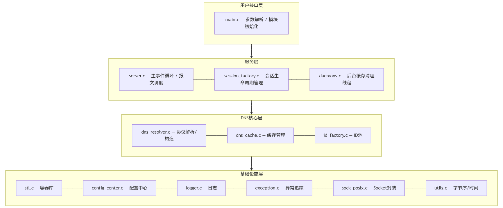

**3.2 模块详细划分**

**3.2.1 基础设施层**

**（1）容器模块****(****stl)**

文件：include/infra/stl.h、src/infra/stl.c

功能：提供通用数据结构实现

Vector(动态数组)：自动扩容，支持尾部追加和任意位置插入

LinkedList(双向链表)：支持头尾插入，遍历通过函数指针回调

PriorityQueue(优先队列/最小堆)：懒删除机制，删除时标记而非移除

HashMap(哈希表)：链地址法处理冲突，load factor超过0.75时扩容2倍

**（2）异常追踪模块****(****exception)**

文件：include/infra/exception.h、src/infra/exception.c

功能：类似try-catch的错误追踪机制，将控制流和诊断流解耦

ex_try()：重置上下文，开启新一轮错误记录

ex_throw(format, ...)：向上下文追加诊断信息

ex_catch()：是否发生错误

ex_end()：取走完整诊断链并重置上下文

**（3）日志模块****(****logger)**

文件：include/infra/logger.h、src/infra/logger.c

功能：分级日志输出系统（TRACE/DEBUG/INFO/WARN/ERROR）

**（4）配置中心模块****(****config)**

文件：include/infra/config.h、src/infra/config_center.c

功能：统一配置管理，支持INI格式配置文件和延迟解析。

**（5）Socket封装模块****(****sock_posix)**

文件：include/infra/socket.h、src/infra/sock_posix.c

功能：对POSIX socke系统调用的薄封装层。创建IPv6双栈socket，通过IN6_IS_ADDR_V4MAPPED识别IPv4映射地址。

**（6）工具函数模块****(****utils)**

文件：include/infra/utils.h、src/infra/utils.c

功能：时钟和2/4/8/16字节宽度字节序转换函数。

**3.2.2 DNS核心层**

**（1）协议处理模块****(****dns_resolver****)****— 核心模块**

文件：include/dns/protocol.h、src/dns/dns_resolver.c

功能：DNS协议的完整实现，包括报文解析、序列化和构造。无状态设计。

数据模型：

```c
DnsPacket
├── SectionHeader(12字节固定报头: id/flags/qcount/answer_RRs/authority_RRs/additional_RRs)
├── questions: Vector<SectionQuestion>(qname/qtype/qclass)
└── rrs: Vector<ResourceRecord>(name/type/class/ttl/rdata_length/rdata)
```

(注：DnsPacket中answers、authorities、additionals三个段的RR存储在同一个rrs Vector中，按answer→authority→additional的顺序连续排列）

序列化：Header整体memcpy后字节序转换→Question段strcpy qname+h2n_2 qtype/qclass→RR段使用name_serialize实现域名压缩指针+定长字段字节序转换+rdata直接memcpy

反序列化：大小校验→Header memcpy+字节序转换→Question段strdup+n2h_2→RR段使用name_deserialize递归解引用压缩指针+定长字段+rdata。rdata反序列化对CNAME/NS/MX类型特殊处理（解引用域名指针），其他类型直接memcpy。

包构造：

pack_try_response_local()：决策入口，返回CLIENT/UPSTREAM

pack_make_query_relay()：克隆查询包，将ID替换为中继ID

pack_make_response_relay()：克隆上游响应，恢复客户端ID，同时将RR写入缓存

query_post_validate()：后置检查，遍历A/AAAA记录若rdata全0则设不良网站拦截

**（2）缓存模块****(****dns_cache)**

文件：include/dns/cache.h、src/dns/dns_cache.c

功能：DNS资源记录的缓存管理

数据结构：

```c
typedef struct CacheEntry {
char *key;                  // "qclass|qtype|qname"
CacheValue value;           // 深拷贝后的RR列表+三段计数
ms created_at;              // 缓存写入时刻
struct CacheEntry *hotter;  // LRU：更常用的条目
struct CacheEntry *colder;  // LRU：更不常用的条目
} CacheEntry;
typedef struct {
HashMap *table;             // key → CacheEntry*，O(1) 存取
CacheEntry *head;           // LRU 哨兵（不持有数据）
CacheEntry *tail;           // LRU 哨兵（不持有数据）
mtx_t lock;
int size;                   // 当前条目数
int capacity;               // 默认 1024
} DnsCache;
```

采用HashMap+LRU双向链表双索引结构。HashMap提供O(1)查找，LRU链表提供淘汰策略（容量满时淘汰最冷条目）和遍历清理。

缓存接口通过CacheValue结构体与协议层交互，包含answer、authority、additional三段RRs的计数和统一的rrs Vector。

过期判断：遍历entry中所有RR，若任一条RR满足(now - created_at)/ 1000 >= ttl且ttl不为UINT32_MAX，则认为过期。

IP对照表加载（load_ip_table）：解析域名=IP格式文件，按(qname, qtype)聚合同域名的RR，生成CacheValue写入缓存，TTL设为UINT32_MAX永不过期。

**（3）ID池管理模块****(****id_factory)**

文件：include/dns/id.h、src/dns/id_factory.c

功能：栈结构管理16位ID的、复杂度为O(1)的分配与回收，标记数组防重复释放，无锁设计（仅主线程使用）。

**3.2.3 服务层**

**（1）服务器主模块****(****server)**

文件：include/server/server.h、src/server/server.c

功能：DNS服务器的核心调度模块。

Session结构：

```c
typedef struct {
uint16_t client_id;      // 客户端请求ID
NetEnd client_ip;        // 客户端地址
RelayInfo relay_info;    // 中继信息(timestamp/retry_times/relay_packet)
} Session;
```

主循环：计算最近超时→select等待→收包处理/超时处理

上游负载均衡：轮询策略

**（2）会话管理模块****(****session_factory)**

文件：include/server/session.h、src/server/session_factory.c

功能：双索引存储（HashMap按relay_id查找+PriorityQueue按timestamp排序），删旧的、加新的以更新会话时间戳。

**（3）守护线程模块****(****daemons)**

文件：include/server/daemon.h、src/server/daemons.c

功能：每4秒调用dns_cache_prune()清理过期缓存。

**3.2.4 用户接口层**

main.c — 程序入口，依次完成了以下功能：

1. 初始化配置系统、解析命令行参数并加载配置文件、将命令行参数注入配置层

2. 初始化日志系统、ID 池、DNS 缓存、会话工厂

3. 启动DNS中继服务器，进入主事件循环，开始处理客户端查询。

**3.3 模块依赖关系**

各模块的依赖关系按层列出如下：

infra基础设施层（无外部依赖）

| 模块 | 依赖 |
| --- | --- |
| stl | 无 |
| exception | 无 |
| utils | 无 |
| socket | stl, utils |
| logger | config, utils |
| config | stl, exception |

DNS核心层（依赖基础设施层）

| 模块 | 依赖 |
| --- | --- |
| dns_resolver | stl, exception, utils, cache |
| dns_cache | stl, dns_resolver, config, utils |
| id_factory | 无 |

server服务层（依赖前两层）

| 模块 | 依赖 |
| --- | --- |
| server | config, logger, socket, session_factory, dns_resolver, id_factory, daemons, exception |
| session_factory | dns_resolver, socket, utils, stl |
| daemons | dns_cache, exception, logger |

用户接口层（依赖其他所有层）

| 模块 | 依赖 |
| --- | --- |
| main | config, server, dns_cache, id_factory, logger, session_factory |

**3.4 整体流程**

源文件列表

| 文件路径 | 职责 |
| --- | --- |
| src/main.c | 程序入口、命令行解析 |
| src/dns/dns_resolver.c | DNS协议核心实现 |
| src/dns/dns_cache.c | DNS缓存管理 |
| src/dns/id_factory.c | ID池管理 |
| src/infra/stl.c | 容器库实现 |
| src/infra/sock_posix.c | Socket封装实现 |
| src/infra/utils.c | 字节序转换、时间戳 |
| src/infra/logger.c | 日志系统实现 |
| src/infra/config_center.c | 配置解析和管理 |
| src/infra/exception.c | 异常处理机制实现 |
| src/server/server.c | 服务器主循环和业务逻辑 |
| src/server/session_factory.c | 会话管理实现 |
| src/server/daemons.c | 守护线程实现 |

整体流程图

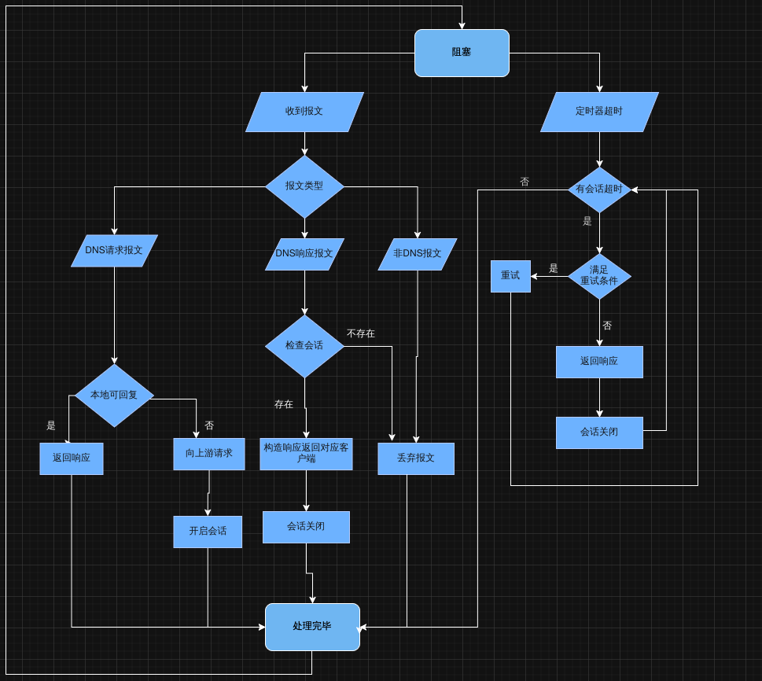

**第四章 功能实现**

```c
说明：为方便展示代码功能，此处注释不规范，实际代码注释规范，以实际文件为准。
```

本章按照DNS中继服务器的运行流程，依次介绍各关键功能的实现细节，并给出核心函数的代码。

**4.1 程序初始化**

程序入口为main()，按序完成各子系统的初始化。初始化顺序经过设计，确保依赖关系正确：配置系统最先就绪，后续模块在初始化时即可读取配置。

```c
int main(int argc,char* argv[]) {
//初始化配置系统
if (config_init()) {
printf("[FATAL] config_init failed\n");
return 1;
}
// 加载配置文件
param_get_config_file(argc, argv);
if (config_load_file(config_file))
printf("[WARN] config file load err,use default config\n");
//解析命令行参数，注入命令行参数到配置层
param_inject_config(argc, argv);
if (logger_init()) {
printf("[ERROR] logger_init failed\n");
return 1;
}
if (id_pool_init()) {
printf("[FATAL]  id_pool_init failed\n");
return 1;
}
ex_try();
if (dns_cache_init()) {
do_log(ERROR,"cache init failed: %s",ex_end());
return 1;
}
ex_try();
if (session_factory_init()) {
do_log( ERROR, "session_factory_init failed:%s",ex_end());
return 1;
}
return server_start();
}
```

命令行参数通过param_inject_config()注入配置层，与配置文件使用统一的读取接口，实现了命令行参数与配置文件的统一管理：

```c
int param_inject_config(int argc,char* argv[]) {
char ips[1024] = {0};
for (int i = 1;i < argc;i++) {
if (!strcmp(argv[i], "-d")) {
config_set(LOG_SECTION,KEY_LOG_LEVEL, (T) DEBUG);
} else if (!strcmp(argv[i], "-dd")) {
config_set(LOG_SECTION,KEY_LOG_LEVEL, (T) TRACE);
}
else if (!strcmp(argv[i], "-c")) {
i++;
}
else {
//什么标记都不带
// dns域名服务器的ip
strcat(ips, ",");
strcat(ips, argv[i]);
}
}
if (*ips != '\0')
config_inject(SERV_SECTION,KEY_UPSTREAMS, ips); // 配置会自己拷贝一份字符串，所以ips用栈存储
return 0;
}
```

**4.2 服务器启动与配置加载**

server_start()是服务层的入口函数，完成配置读取、守护线程创建和Socket初始化：

```c
int server_start() {
ex_try();
// 注册到配置系统
config_register_parser(SERV_SECTION, server_config_parser);
config_register_cleaner(SERV_SECTION, server_config_cleaner);
//初始化降级策略配置
config_get(SERV_SECTION,KEY_PACKET_TIMEOUT, (T *) &request_timeout);
config_get(SERV_SECTION,KEY_MAX_RETRY_TIME, (T *) &max_retry_time);
if (ex_catch())do_log(ERROR, "serv_config read failed %s", ex_end());
//获取上游服务器列表
config_get(SERV_SECTION,KEY_UPSTREAMS, (T *) &upstreams);
if (linked_list_is_empty(upstreams)) {
do_log(ERROR, "server:upstream not configured %s", ex_end());
return -1;
}
//创建守护线程
thrd_t cache_ttl;
thrd_create(&cache_ttl, daemon_dnscache_ttl,NULL);
thrd_detach(cache_ttl);
//初始化socket
ex_try();
if (init_socket()) {
do_log(ERROR, "server start: %s", ex_end());
return -1;
}
//进入主循环,处理请求
recv_buf = malloc(DNS_RECV_BUF_SIZE);
send_buf = malloc(DNS_SEND_BUF_SIZE);
return server_loop();
}
```

配置解析器server_config_parser负责将配置文件中的原始字符串转换为运行时数据结构。上游IP列表通过滑动窗口逐个解析，并验证合法性（禁止localhost防止自我收发死循环）：

```c
int server_config_parser(const char* key,const char* value,T* result) {
if (!strcmp(key,KEY_UPSTREAMS)) {
// value是上游列表
int vl;
if ((vl = strlen(value) + 1) == 1) return 0; // value “”
int i = 0, j = 0; //滑动窗口枚举每个ip串 i指向第一个有效字符，j指向最后一个字符，ip字符串[i,j)
char item[64];
LinkedList *ups = linked_list_create();
if (value[j] == ',')i = ++j; //  第一个"，"被跳过
for (; j < vl; ++j) {
if (value[j] == ',' || value[j] == '\0') {
memcpy(item, &value[i], j - i);
item[j - i] = '\0';
NetEnd *end;
if (validate_ipstr(item) || ipstr2binary(item, &end)) {
// 解析失败
ex_throw("serv_config_parser:upstream failed");
return -1;
}
end->port = SERVER_PORT;
h2n_2((uint16_t *) &end->port);
linked_list_addFirst(ups, end);
i = j + 1;
}
}
*result = ups;
return 0;
}
if (!strcmp(key,KEY_MAX_RETRY_TIME)) {
*result = (T) atol(value); // atol : 字符串转long
return 0;
}
if (!strcmp(key,KEY_PACKET_TIMEOUT)) {
*result = (T) (atol(value) * 1000);
return 0;
}
// 降级为原字符串
return -1;
}
```

**4.3 主事件循环**

server_loop()是整个服务器的核心循环，采用select。每次循环先计算最近超时会话的剩余时间作为select的超时参数，使得select既能等待数据到达，又能在恰当时刻唤醒处理超时：

```c
static int server_loop() {
while (1) {
// 准备select参数
ms next_timeout;
Session *earliest_session = session_peek();
if (!earliest_session)
next_timeout = -1;
else get_session_timeout_remain(earliest_session, request_timeout, &next_timeout);
ex_try(); // 开启错误上下文
do_log(TRACE,"set sleep timeout %ld",next_timeout);
socket_sleep_on(socket_holder, 1, next_timeout);
if (!ex_catch()) {
// 收取dns数据包，select没有错误
DnsPacket *packet;
NetEnd source_end;
while (1) {
int ret = pack_recv(&packet, &source_end); //需要返回值控制
if (ret == 1) {
do_log(TRACE, "server loop: no data in sock");
break; // 没有数据了
}
if (ret == -1) {
// pack_recv有错误，获取上下文
do_log(ERROR, "server loop err: %s", ex_end());
break;
}
// 单个包处理出错对本层控制流无影响，因此不关心返回值也不关心错误，函数自己处理。
handle_dns_packet(packet, source_end);
pack_free(packet);
}
// 超时包处理，这些超时包处理出错也不影响事件循环，不关心结果。
batch_timeout();
}
// select错误，获取上下文
else {
do_log(ERROR, "server error : %s", ex_end());
break;
}
}
return -1;
}
```

当没有活跃会话时，next_timeout设为-1，select无限等待直到数据到达；当有活跃会话时，select最多阻塞到最近一个会话超时，确保超时事件被及时处理。

**4.4 DNS报文收发**

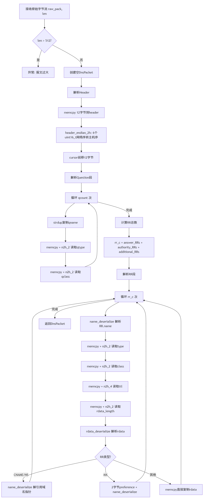

DNS报文的收发通过复用缓冲区实现，避免频繁的内存分配。接收时先从socket非阻塞读取原始字节流，再调用pack_deserialize()反序列化为DnsPacket结构体；发送时先调用pack_serialize()序列化为字节流，再通过socket发送：

```c
int pack_recv(DnsPacket** dns_pack, NetEnd *src) {
const int len = socket_recv_nowait(socket_holder, recv_buf, DNS_RECV_BUF_SIZE, src);
// 空包丢弃
if (len == 0)
return 1;
if (len == -1) {
//无数据
// 在返回途中构建错误发生时的调用链条
ex_throw("pack_recv");
return -1;
}
return pack_deserialize(recv_buf, len, dns_pack);
}
```

**4.5 查询包处理与本地应答决策**

DNS查询包处理流程

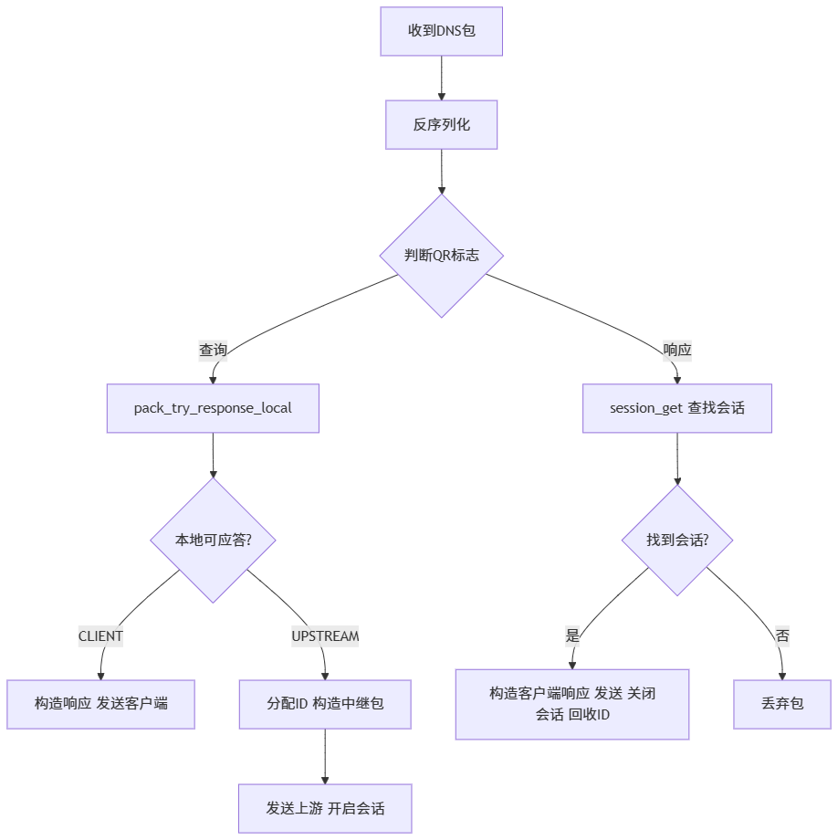

本地应答决策流程

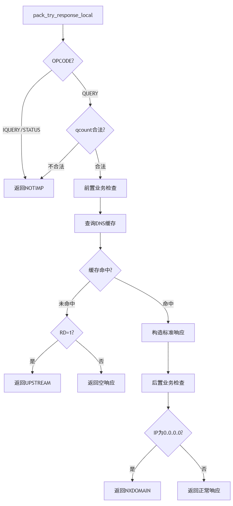

| 宏 | 位范围 | 说明 |
| --- | --- | --- |
| IS_QUERY | bit 15 | QR标志：0=查询，1=响应 |
| OPCODE_GET | bits 14-12 | 操作码提取 |
| RD_GET/SET | bit 8 | RD 标志 |
| RA_SET | bit 7 | RA 标志 |
| QR_SET | bit 15 | 设置为响应包 |
| RCODE | bits 3-0 | 响应码 |

handle_dns_packet()是报文分发核心，根据QR标志区分查询包和响应包，走不同的处理路径：

```c
static void handle_dns_packet(const DnsPacket *packet_in, NetEnd source_end) {
DnsPacket *packet_out; // 临时数据包
ex_try(); // 这里的错误不需要向上传递，自己处理
if (packet_is_query(packet_in)) {
//请求包
PacketDirection direction = pack_try_response_local(packet_in, &packet_out);
if (direction == CLIENT) {
//本地可以直接响应
packet_send(packet_out, &source_end);
pack_free(packet_out);
} // 需要转发
else {
//构造中继包，申请id
uint16_t relay_id;
if (id_alloc(&relay_id)) {
// 没有id了，返回失败响应
do_log(WARN, "server : relay id exhausted,resp fallback");
pack_make_inner_error(packet_in, &packet_out);
packet_send(packet_out, &source_end);
pack_free(packet_out);
return;
}
//发送中继包
pack_make_query_relay(packet_in, relay_id, &packet_out);
packet_send(packet_out, pick_upstream());
// 发不出去
if (ex_catch()) {
do_log(ERROR, "server:relay_query send err,%s", ex_end());
id_free(relay_id);
pack_free(packet_out);
return;
}
// 发送成功 开启会话
session_open(packet_in->header.id, source_end, packet_out);
//释放临时数据
pack_free(packet_out);
}
} else {
// 响应包
//获取对应session
Session *session = session_get(packet_in);
if (session) {
//返回响应给客户端
pack_make_response_relay(packet_in, &packet_out, session->client_id);
packet_send(packet_out, &session->client_ip);
if (ex_catch()) // 发不出去
do_log(ERROR, "server:relay-response ,%s", ex_end());
//结束会话
session_close(session);
id_free(packet_in->header.id);
pack_free(packet_out);
} else do_log(WARN, "server : no session match rsp id %d, drop pack",packet_in->header.id);
}
}
```

pack_try_response_local()实现了三级决策逻辑：先检查OPCODE合法性，再查询缓存，最后进行后置业务检查（0.0.0.0拦截）：

```c
PacketDirection pack_try_response_local(const DnsPacket *query, DnsPacket **response) {
switch (OPCODE_GET(query->header.flags)) {
case QUERY:
//检查问题个数
if (query->header.qcount > 1) {
do_log(DEBUG,"qdcount >1");
make_response_fail(query, response, RCODE_NOTIMP);
break;
}
if (query->header.qcount == 0) {
do_log(DEBUG,"empty query");
make_response_empty(query, response);
break;
}
// 前置业务检查
Rcode code;
query_pre_validate(query, &code);
if (code != RCODE_NOERROR) {
make_response_fail(query, response, code);
break;
}
// 现在才真正开始回答
//查看缓存
CacheValue cache_value;
SectionQuestion *q = vector_get(query->questions, 0);
do_log(INFO, "id %d,qname: [%s]", query->header.id, q->qname);
if (dns_cache_get(q->qname, q->qtype, q->qclass, &cache_value)) {
// 缓存没有，看Rd
do_log(DEBUG, "cache miss");
if (RD_GET(query->header.flags))
return UPSTREAM;
// 不需要转发
make_response_empty(query, response);
break;
}
// 查到缓存，构造响应包
do_log(DEBUG, "cache hit");
pack_make_std_response_local(query, response, cache_value);
free_rrs(cache_value.rrs);
// 后置业务检查
query_post_validate(*response, &code);
if (code != RCODE_NOERROR) {
// 检查不通过，返回对应失败响应
pack_free(*response);
make_response_fail(query, response, code);
}
break;
case IQUERY:
do_log(DEBUG, "iquery recv");
make_response_fail(query, response, RCODE_NOTIMP);
break;
case STATUS:
do_log(DEBUG, "status query recv");
make_response_status(query, response);
break;
default: make_response_empty(query, response);
}
return CLIENT;
}
}
```

后置业务检查query_post_validate()遍历answer段中的A/AAAA记录，若rdata全为0则返回NXDOMAIN，实现了不良网站拦截：

```c
static void query_post_validate(const DnsPacket *response, Rcode *rcode) {
//检查ans，如果ip有0.0.0.0返回NXDMAIN
Vector *ans = response->rrs;
for (int i = 0; i < response->header.answer_RRs; i++) {
ResourceRecord *rr = vector_get(ans, i);
if ((rr->type == QTYPE_A || rr->type == QTYPE_AAAA) && memallz(rr->rdata, rr->rdata_length)) {
*rcode = RCODE_NXDOMAIN;
return;
}
}
}
```

**4.6 缓存查询**

dns_cache_get()根据查询三元组(qname, qtype, qclass)查找缓存。命中时深拷贝CacheValue返回给调用方，并将条目移至LRU头部；过期或未命中则返回miss：

```c
int dns_cache_get(const char *qname, Qtype type, Class qclass, CacheValue *result) {
if (g_cache == NULL || qname == NULL || result == NULL) {
return 1;
}
// 这个key是临时堆内存数据，需要free
char *key = cache_key_create(qname, type, qclass);
if (key == NULL) {
return 1;
}
// 加锁
if (mtx_lock(&g_cache->lock) != thrd_success) {
free(key);
return 1;
}
// 获取缓存条目
CacheEntry *entry = NULL;
if (hash_map_get(g_cache->table, key, (T *) &entry) != 0 || entry == NULL) {
mtx_unlock(&g_cache->lock);
free(key);
return 1;
}
// 过期检查
if (is_entry_expired(entry)) {
cache_remove_entry(entry);
do_log(TRACE,"cache hit but expired : [%s,%u]",qname,type);
mtx_unlock(&g_cache->lock);
free(key);
return 1;
}
// 深拷贝到 result
memset(result, 0, sizeof(CacheValue));
if (!cache_value_clone(result, &entry->value)) {
mtx_unlock(&g_cache->lock);
ex_throw("cache_get: cache_value_clone failed");
free(key);
return 1;
}
// LRU 移至头部
lru_touch(g_cache, entry);
mtx_unlock(&g_cache->lock);
free(key);
return 0;
}
```

缓存写入dns_cache_put()若key已存在则原地更新（释放旧值、深拷贝新值、更新时间戳、LRU移至头部），若key不存在且容量满则淘汰最冷条目后新建：

```c
int dns_cache_put(const char *qname, Qtype type, Class qclass, CacheValue cache_value) {
if (g_cache == NULL || qname == NULL || cache_value.rrs == NULL) {
return 1;
}
/*
* 流程：
* 1. 构造查询 key
* 2. 加锁
* 3. prune 清理过期条目
* 4. 如果 key 已存在 → 释放旧 value.rrs，深拷贝新 RR，更新 created_at，LRU 移至头部
* 5. 如果 key 不存在 → 容量满则淘汰最冷条目 → 创建 CacheEntry → hash_map_put + LRU 头插
* 6. 解锁
*/
char *key = cache_key_create(qname, type, qclass);
// 加锁
if (mtx_lock(&g_cache->lock) != thrd_success) {
free(key);
return 1;
}
// make entry
CacheEntry *entry = NULL;
if (hash_map_get(g_cache->table, key, (T *) &entry) == 0 && entry != NULL) {
// key 已存在：原地更新
CacheValue new_value ;
if (!cache_value_clone(&new_value, &cache_value)) {
// 深拷贝失败
ex_throw("cache_put: cache_value_clone failed");
mtx_unlock(&g_cache->lock);
free(key);
return 1;
}
// 释放旧的rrs，挂载新的rrs
free_cache_value(&entry->value);
entry->value = new_value;
entry->created_at = sys_time_ms();
lru_touch(g_cache, entry);
} else {
// key 不存在：新建条目
// 容量检查：满则淘汰最冷条目（tail->hotter）
if (g_cache->size >= g_cache->capacity) {
CacheEntry *victim = g_cache->tail->hotter;
if (victim != g_cache->head) {
do_log(DEBUG,"cache full, evict: [%s,%u]",qname,type);
cache_remove_entry(victim);
}
}
entry = cache_entry_create(qname, type, qclass, &cache_value);
// hash_map_put 直接存储 key 指针，所以需要 strdup 让 HashMapEntry 持有独立拷贝
char *map_key = strdup(entry->key);
hash_map_put(g_cache->table, map_key, entry);
// LRU 头插
lru_touch(g_cache, entry);
g_cache->size++;
}
mtx_unlock(&g_cache->lock);
free(key);
return 0;
}
```

**4.7 中继查询构造与发送**

当本地无法应答时，需要将查询包转发到上游DNS服务器。pack_make_query_relay()通过克隆原始查询包并替换ID实现，保持了原始查询的所有字段不变：深拷贝原始查询包（包括questions和rrs）仅替换ID字段为中继ID，其余字段保持不变。上游服务器选择采用轮询策略，通过链表遍历实现。

**4.8 会话管理**

DNS中继ID转换流程

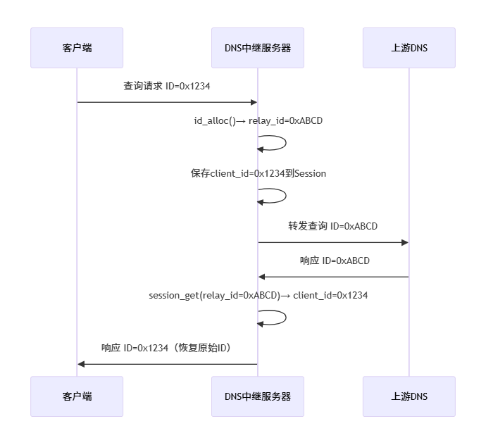

会话超时管理采用懒删除堆（最小堆+标记数组），而非直接删除，原因如下：

优先队列的删除操作通常需要O(n)搜索定位元素再加O(log n)重建堆，开销较大，而仅标记不实际移动元素将删除操作降为O(1)。被标记元素在比较时永远小于未删除元素，自然上浮到堆顶，在pop/peek时批量清理；且会话时间戳更新通过删旧标记+重新入队实现：先lazy_heap_remove标记旧引用删除，再lazy_heap_add以新时间戳入队，保证堆结构正确且操作高效

中继查询发送后，需要建立会话以匹配后续的上游响应。会话管理采用双索引结构：HashMap按relay_id提供O(1)查找，PriorityQueue按timestamp排序支持超时检测。session_open()创建会话并加入等待队列：

```c
int session_open(uint16_t client_id,NetEnd client_ip,const DnsPacket * relay_pack) {
Session *session = malloc(sizeof(Session));
do_log(DEBUG, "session open for cli-%d,reid-%d", client_id, relay_pack->header.id);
session->client_id = client_id;
session->client_ip = client_ip;
session->relay_info.retry_times = 0;
session->relay_info.relay_packet = packet_clone(relay_pack);
hash_map_put(agent_id_sessions, (K) session->relay_info.relay_packet->header.id, session);
session_wait(session);
return 0;
}
```

session_wait()更新会话时间戳，维护优先队列的正确性：从优先队列中标记删除旧记录，更新时间戳为当前时刻，以新时间重新入队，保证堆结构正确。session_close()关闭会话，从HashMap和优先队列中移除，释放中继包和会话本身。

**4.9 响应包处理与中继响应构造**

收到上游响应后，通过session_get()根据响应包的ID查找对应会话，恢复客户端ID后将响应发送给客户端。pack_make_response_relay()同时将上游响应中的RR写入缓存：

```c
void pack_make_response_relay(const DnsPacket *recv, DnsPacket **send, uint16_t client_id) {
*send = packet_clone(recv);
(*send)->header.id = client_id;
// 缓存资源记录
SectionQuestion * q = vector_get(recv->questions,0);
CacheValue value;
value.answer_RRs = (*send)->header.answer_RRs;
value.authority_RRs = (*send)->header.authority_RRs;
value.additional_RRs = (*send)->header.additional_RRs;
value.rrs = recv->rrs;
dns_cache_put(q->qname,q->qtype,q->qclass,value);
}
```

注意此处value.rrs = recv->rrs传递的是原始指针，dns_cache_put()内部会做深拷贝，因此不会影响原始包的释放。

**4.10 超时重试处理**

超时处理流程

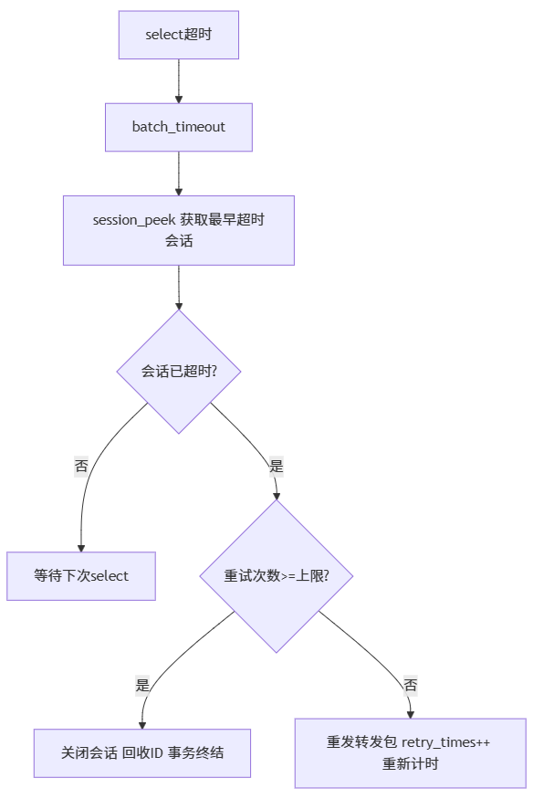

batch_timeout()在每次select返回后检查所有已超时的会话，依次处理：

```c
static void batch_timeout() {
Session *session = NULL;
ms time_remain;
while ((session = session_peek())) {
get_session_timeout_remain(session, request_timeout, &time_remain);
if (time_remain > 0)
break;
do_log(WARN, "session timeout (%d-%d).", session->client_id, session->relay_info.relay_packet->header.id);
do_handle_timeout(session);
}
}
```

do_handle_timeout()根据重试次数决定是重发还是终结会话。重试时重新选择上游服务器发送，并通过session_wait()更新时间戳：

```c
static void do_handle_timeout(Session* session) {
uint16_t relay_id = session->relay_info.relay_packet->header.id;
if (session->relay_info.retry_times >= max_retry_time) {
id_free(relay_id);
do_log(WARN,"session (%d-%d) close after retrying %d times",session->client_id,relay_id,session->relay_info.retry_times);
session_close(session);
return;
}
// 再次发送
ex_try();
if (packet_send(session->relay_info.relay_packet, pick_upstream()) == -1)
do_log(ERROR, "timeout resend failed %s", ex_end());
session->relay_info.retry_times++;
session_wait(session);
}
```

**第五章 测试用例**

**5.1 测试环境**

| 项目 | 说明 |
| --- | --- |
| 操作系统 | Linux (Ubuntu) |
| 编译器 | GCC |
| 构建工具 | CMake 3.5+ |
| 测试工具 | nslookup, ping, iptables |
| 上游DNS | 10.3.9.6, 10.3.9.4 |
| 对照表文件 | dnsrelay.txt |

**5.2 基本功能测试**

**测试用例1：本地应答测试**

测试目的：验证DNS中继服务器能正确加载IP地址-域名对照表，对表中配置了普通IP地址的域名直接返回对应的本地解析结果，不转发至上游服务器。

测试步骤：

准备IP地址-域名对照表文件dnsrelay.txt

启动DNS中继服务器：sudo ./DnsRelay -d

使用nslookup查询对照表中的域名：

验证服务器日志中输出非中继转发

实验结果：

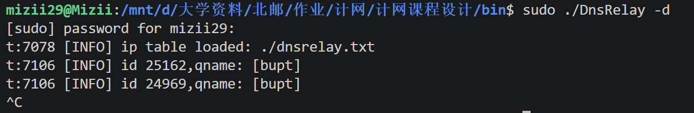

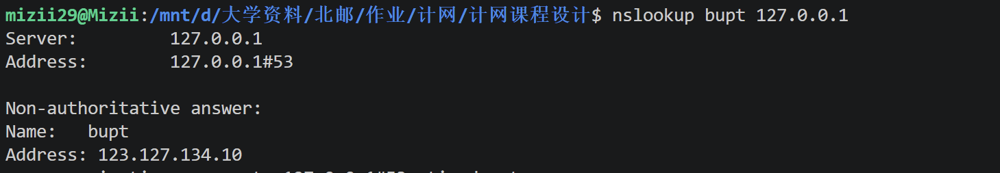

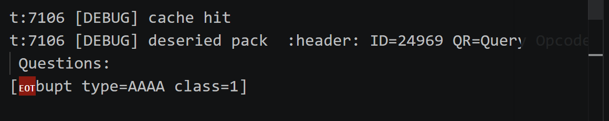

**测试用例2：基本DNS查询中继**

测试目的：验证DNS中继服务器能正确转发查询请求至上游DNS服务器，并向上游响应正确返回给客户端。

测试步骤：

1. 启动DNS中继服务器：sudo ./DnsRelay -d

2. 另开终端执行查询：nslookup www.baidu.com 127.0.0.1

实验结果：

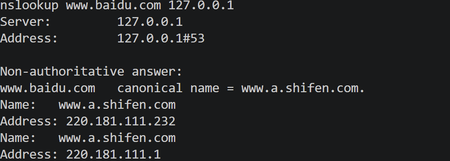

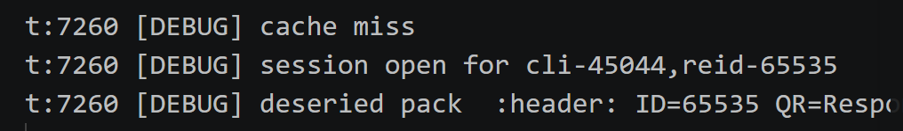

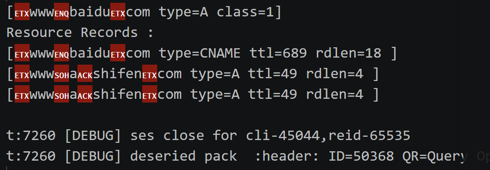

（type=AAAA情况与type=A类似，省略）

客户端收到www.baidu.com的正确IP地址。服务器日志显示缓存未命中、创建中继会话、转发至上游、收到上游响应、关闭会话并且将RR写入缓存。

**测试用例3：不良网站拦截**

测试目的：验证当配置文件中域名的IP为0.0.0.0时，服务器返回NXDOMAIN（域名不存在）响应，实现不良网站拦截功能。

测试步骤：

1. 测试随机不在dnsrelay中的真实域名

在dnsrelay.txt中设置其为拦截域名

启动DNS中继服务器并重复查询

结果：一开始可以收到相应，封禁后返回域名不存在响应

封禁前：

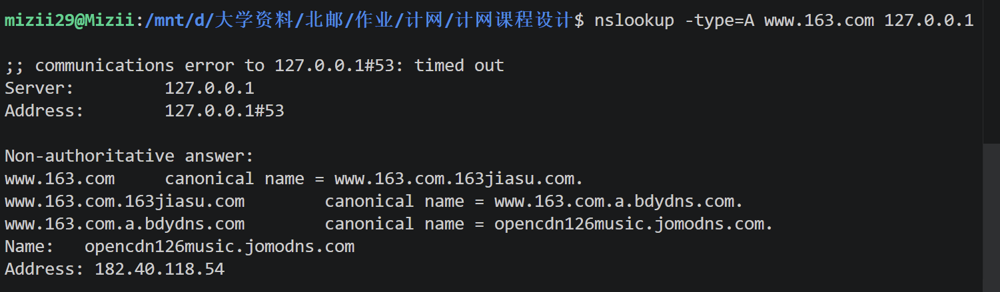

封禁：（更改dnsrelay.txt）

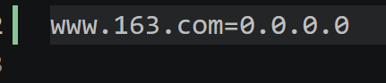

封禁后：

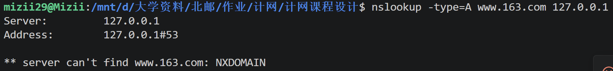

**测试用例4：DNS缓存命中与超时机制**

测试目的：验证DNS缓存机制能正确存储、命中、过期和重新加载资源记录。

测试步骤：

1. 启动DNS中继服务器：sudo ./DnsRelay -dd 10.3.9.6

2. 第一次查询（缓存未命中）

3. 立即第二次查询（应命中缓存）

4. 等待TTL过期（sleep 300）

5. 再次查询（缓存已过期）

测试结果：


日志内容：

第一次查询：服务器转发请求到上游（cache miss），收到响应后将RR写入缓存。

第二次查询（+7秒）：服务器直接从缓存返回响应（cache hit），无session创建、无上游转发。

等待期间：后台守护线程每4秒执行一次cache ttl checked，检测缓存条目是否过期。

第三次查询（+374秒）：缓存条目已过期被清理，服务器重新转发至上游（cache miss），获取新的RR并写入缓存，TTL重新计时为300秒。

**5.3 容错与并发测试**

**测试用例5：超时重试**

测试目的：验证当上游DNS服务器不可达时，服务器能正确执行超时检测、重试和会话终止。

测试步骤：

1. 寻找同局域网内未被使用的 IP

sudo ./bin/DnsRelay -d 10.3.9.22 -dd

启动DNS中继服务器，发起DNS查询

测试结果：

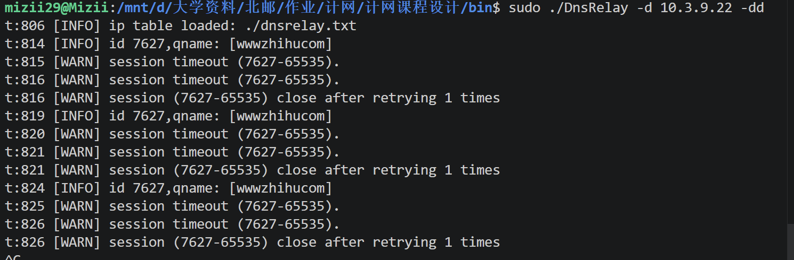

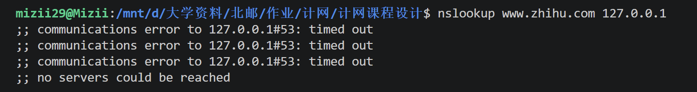

Sendto成功发出后，约1秒后触发首次超时，选择上游服务器重新发送中继包，触发第二次超时，最后关闭会话，超时重试终止。客户端收到系统超时错误。

**测试用例6：多客户端并发查询**

测试目的：验证服务器能同时处理多个客户端的并发DNS查询请求，ID转换机制正确匹配各请求与响应。

测试步骤：

1. 编写并发请求脚本，同时发起5个nslookup查询

2. 启动DNS中继服务器：./DnsRelay -d

3. 运行脚本，观察服务器日志

运行结果：

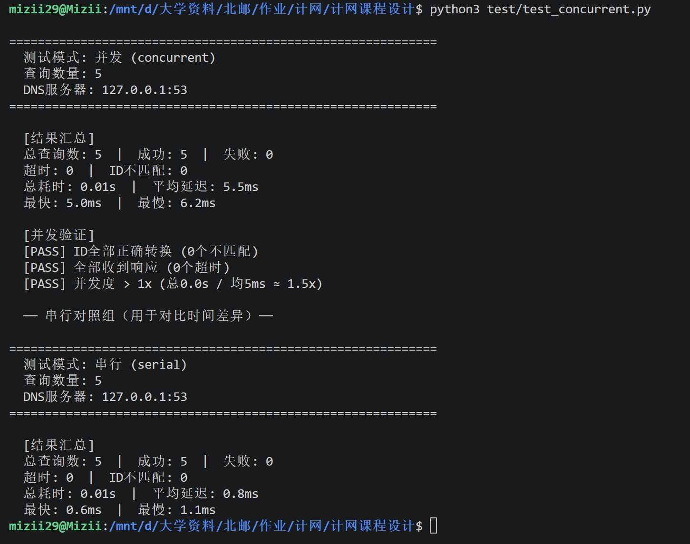

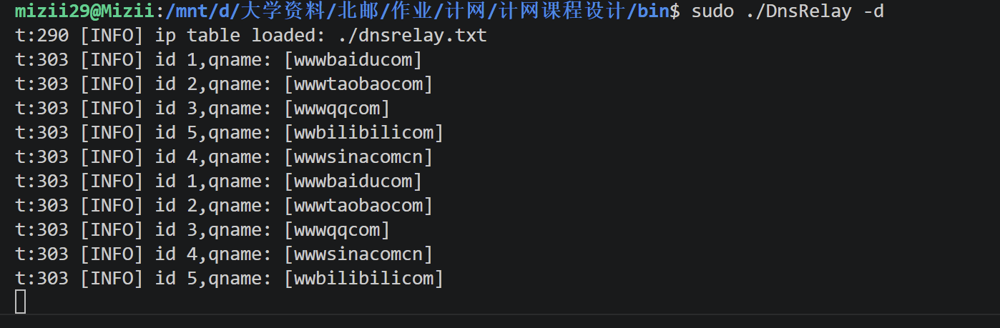

日志内容：

首次轮询：


缓存命中：

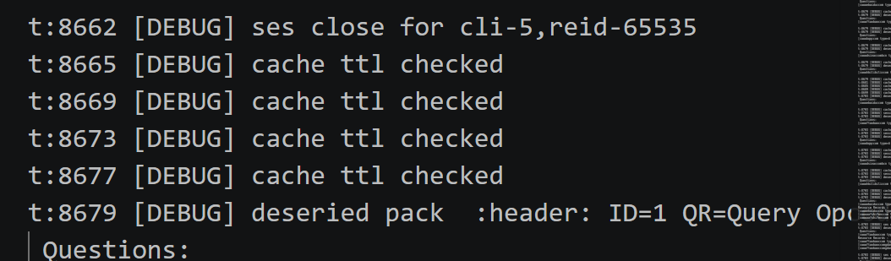

5个 session全部open之后才陆续close，5个不同的relay ID（65535/65534/65533/65532/65531）互不冲突，且实现了乱序匹配：响应到达顺序与查询发出顺序不同，但全部正确匹配回对应 client_id。

验证了服务器在首个查询未完成时即可处理后续查询，ID 转换机制正确匹配各请求与响应

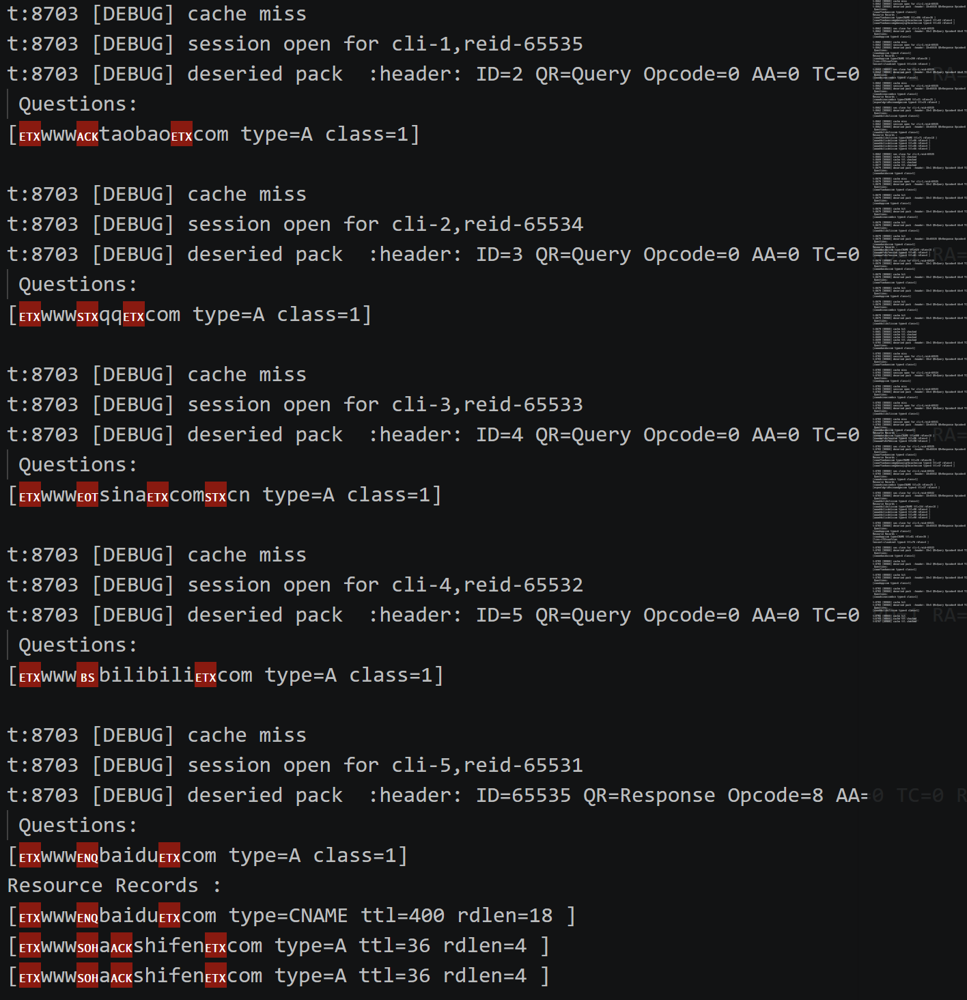

脚本输出5个查询全部获得正确的IP地址响应。

5个查询的client_id各不相同，对应的relay_id也各不相同，验证ID转换机制为每个会话分配了独立的中继ID。

**5.4 配置与鲁棒性测试**

**测试用例7：配置文件加载与多上游服务器轮询**

测试目的：验证INI格式配置文件能正确加载和解析，多上游服务器按Round-Robin策略轮询分配。

配置文件（dnsrelay.ini）：

[server]

server_upstream=10.3.9.6,10.3.9.4

dns_packet_timeout=1

max_retry_time=1

[dns]

iptable=./dnsrelay.txt

[log]

log_level=TRACE

DEBUG=./debug.txt

TRACE=./debug.txt

测试步骤：

1. 使用-c参数指定配置文件启动服务器：sudo ./DnsRelay -c dnsrelay.ini

2. 发起不同域名的DNS查询：

```c
nslookup domain1.example.com 127.0.0.1
nslookup domain2.example.com 127.0.0.1
nslookup domain3.example.com 127.0.0.1
```

3. 验证每次转发的目标上游服务器

测试结果：

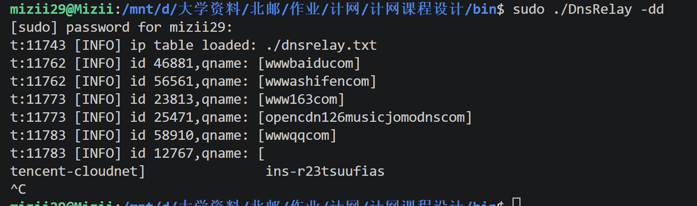

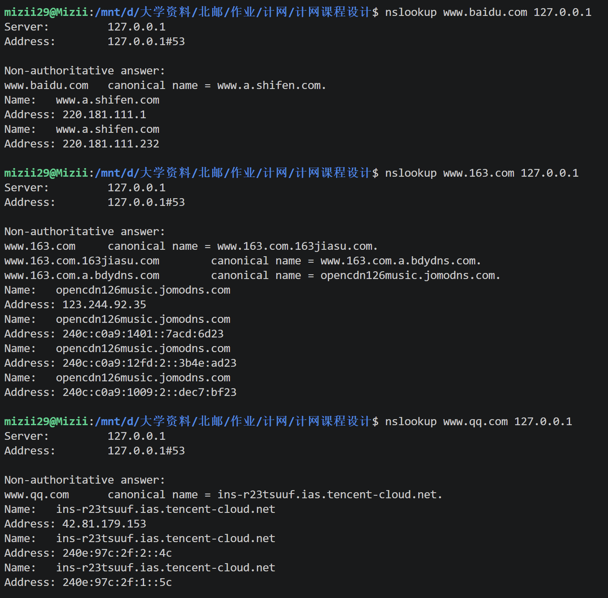

通过Wireshark 抓包验证多上游服务器轮询策略。过滤器udp port 53，在WSL虚拟网卡上捕获。可观察到客户端（172.22.80.92）向DNS中继服务器（127.0.0.1:53 上运行）发起查询后，中继服务器按Round-Robin策略交替选择上游10.3.9.4和10.3.9.6进行转发。三次不同域名查询（baidu、163、qq）分别命中不同上游服务器，验证了配置文件中两个上游的轮询负载均衡机制生效。


**测试用例8：异常****上游****处理**

**子测试8-1：上游服务器IP为空**

测试步骤：

1. 临时将server_upstream设为空：

2. 启动服务器

测试结果：

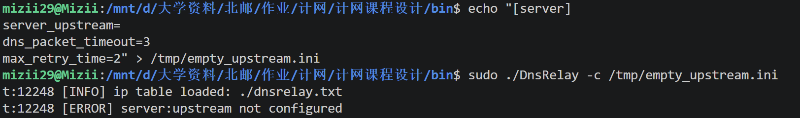

服务器检测到upstream列表为空，输出错误日志"server:upstream not configured"，server_start()返回-1，服务器拒绝启动，不占用端口。

**子测试8-2：上游服务器IP为localhost（127.0.0.1）**

测试步骤：

1. 启动服务器：

sudo ./DnsRelay -d 127.0.0.1

测试结果：

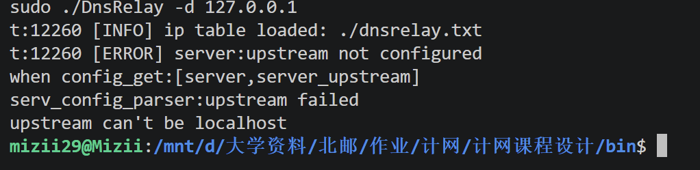

服务器检测到127.0.0.1为回环地址，config_load_file返回失败，服务器拒绝启动。

**测试用例9：格式错误报文处理**

测试目的：验证服务器能正确处理各类格式异常的DNS报文，不会因异常输入而崩溃或进入未定义状态。

测试脚本包含：报文长度小于12字节、报文长度超过512字节、Question数量异常、非法OPCODE

测试步骤：

1. 创建python脚本并且运行

测试结果：


构造4类异常DNS报文发送至服务器：报文长度<12字节、>512字节、qcount>1、OPCODE=IQUERY。其中<12字节和>512字节触发 pack_deserialize() 大小校验异常，报文被静默丢弃；qcount>1和IQUERY触发 pack_try_response_local() 分支判断，返回 RCODE=4（NOTIMP）。4项测试均符合预期，服务器未崩溃。

**第六章 调试中遇到并解决的问题**

**6.1 DNS报文解析中的域名压缩指针问题**

问题描述：在实现DNS报文反序列化时，最初只考虑了普通域名编码，没有处理RFC 1035中定义的域名压缩指针。当解析上游DNS服务器返回的响应包时，程序崩溃。

原因分析：DNS协议允许在RR的name字段使用压缩指针（高2位为11，低14位为偏移量）。代码没有识别这种指针格式，将其当作普通标签长度处理，导致访问非法内存。

解决方案：实现name_deserialize()函数，递归地解引用压缩指针。当检测到(cur_p & 0xC0)== 0xC0时，读取2字节取低14位偏移量，跳转到报文内引用位置获取后缀域名，与前缀拼接：

```c
int name_deserialize(const char *buf, const char *cur_p, char **res) {
//dns编码的格式： n n个字符 m m个字符 两个字节指针
// 也就是说，指针会出现在完整标签之后，
// 假设有指针，遍历确定指针位置
int i = 0;
while (cur_p[i] && (cur_p[i] & 0xC0) != 0xC0)
i += cur_p[i] + 1;
if (!cur_p[i]) {
//表明这个字段不含指针，直接原样复制
*res = strdup(cur_p);
return strlen(cur_p) + 1;
}
// 到这里，说明cur_p[i]是指针头
uint16_t offset;
memcpy(&offset, (uint16_t *) &cur_p[i], 2);
n2h_2(&offset);
offset ^= 0xC000; //高两位置0
char *suffix;
name_deserialize(buf, buf + offset, &suffix);
*res = malloc(i + strlen(suffix) + 1);
memcpy(*res, cur_p, i); //第一段
memcpy(&(*res)[i], suffix, strlen(suffix) + 1); //第二段
free(suffix);
// 一个域名字段只会有一个指针,并且指针是域名最后两个字节，所以到此为止了
return i + 2;
}
```

**6.2特殊上游IP收发包死循环问题**

指定上游IP为本机IP时，会出现收发包死循环，id迅速耗尽

问题分析：当上游服务器IP被配置为本机地址时，服务器将查询转发给自己，自身接收到该转发包后再次识别为查询请求，重复执行缓存查找-未命中-转发-再次发给自己的流程，形成无限循环。每次迭代都会调用id_alloc() 分配新的中继ID并创建新Session，ID池（共65536个）将在短时间内耗尽，之后所有新查询均因id_alloc失败而返回 SERVFAIL。

解决方案：server.c中server_config_parser在解析每个上游IP时调用，通过 validate_ipstr() 函数对上游IP进行校验，拒绝回环地址。检测到非法配置时调用 ex_throw 标记错误，使config_load_file返回失败，服务器拒绝启动。

**6.3 DNS查询键与资源记录键不一致导致的缓存失配问题**

本项目的 DNS 中继服务会将上游返回的查询结果写入本地缓存。但在开发中发现：当响应包含CNAME链式跳转时，后续对同一问题的重复查询仍会缓存未命中。经分析，这不是简单的缓存缺失，而是DNS查询键与资源记录键不一致导致的缓存失配问题。

以查询 www.baidu.com A 为例，上游服务器可能返回如下链式应答：

```c
www.baidu.com CNAME www.a.shifen.com
www.a.shifen.com A 220.181.111.232
www.a.shifen.com A 220.181.111.1
```

客户端发出的原始问题是 (www.baidu.com,A, IN)，但响应中的资源记录并不都是 (www.baidu.com,A,IN)，而是分成了 (www.baidu.com, CNAME, IN) 和 (www.a.shifen.com,A,IN)。这样就导致后续再次查询 www.baidu.com A 时，无法直接通过问题三元组命中之前缓存下来的 RR。也就是说，客户端真正使用的查询键与缓存写入时使用的资源记录键发生了偏离。

旧版缓存以单条RR的(name,type,class)为索引键。当响应含CNAME链时，查询问题是(www.baidu.com,A,IN)，而被缓存的RR键来自各条记录自身的name——分别是(www.baidu.com,CNAME,IN)和(www.a.shifen.com,A,IN)——与查询键不匹配，导致缓存miss。

解决方案：将缓存单位从单条RR改为"问题-完整响应集"。缓存key固定为查询三元组(qname, qtype, qclass)，value为整个响应结果集，使缓存语义与DNS查询语义对齐。

为适配项目当前的数据结构，我们引入了 CacheValue 作为缓存值：

```c
typedef struct {
uint16_t answer_RRs;
uint16_t authority_RRs;
uint16_t additional_RRs;
Vector* rrs;
} CacheValue;
```

其中 rrs 保存完整 RR 列表，answer_RRs/authority_RRs/additional_RRs 记录三个段的条目数量。这样一来，缓存项的逻辑从原来的RR→RR变成了Question→CacheValue，例如(www.baidu.com,A,IN)→[CNAME,A,A]。当同样的查询再次到来时，系统只需要按问题三元组查缓存，就能直接命中这一整组结果，而不需要再去分析其中的 CNAME 跳转关系。

方案解决了CNAME 链式响应下由于查询键/资源记录键不一致造成的缓存失配问题；缓存语义更加符合 DNS 查询本身，一个问题对应一个完整结果集；缓存层职责更清晰，不需要在查询阶段额外进行多次查找或递归拼装；该模型同时适用于动态缓存和预缓存，便于统一实现。

**第七章 总结和心得体会**

**7.1 项目成果总结**

本项目成功实现了一个功能完整的DNS中继服务器，具备以下核心能力：

1. 三级查询响应：本地DNS解析、中继转发、不良网站拦截三种处理策略

2. 并发处理：通过select模型，单线程高效处理多客户端并发查询

3. DNS缓存：基于HashMap+LRU链表的缓存系统，支持TTL过期管理、LRU淘汰和线程安全访问

4. 超时重试：完整的超时检测和重试机制

5. ID转换：高效的ID池管理，支持65536个并发中继会话

6. 配置灵活：支持命令行参数和INI配置文件，延迟解析机制

7. 错误追踪：创新的异常追踪机制，将分散的错误日志整合为完整调用链

8. 跨平台：Socket抽象层屏蔽系统差异

**7.2 项目亮点**

1. 递归式域名压缩指针解引用

DNS协议中的域名压缩指针可以出现在RR的name字段和rdata字段中（CNAME/NS/MX类型），且一个域名字段最多包含一个指针，指针前可以有若干标签。本项目的name_deserialize()函数采用递归方式处理：先遍历标签直到遇到指针或结尾，若遇到指针则递归解引用后缀，将前缀标签与后缀拼接。这种设计正确处理了指针嵌套在域名中间的情况，比简单的"检测0xC0则跳转"方案更健壮。

2. LRU缓存淘汰策略

缓存模块采用HashMap+LRU双向链表双索引结构，使用哨兵节点（head/tail）简化链表操作边界条件。容量满时淘汰最冷条目（tail->hotter），而非简单拒绝写入。查询命中时通过lru_touch()将条目移至链表头部。对照表条目TTL设为UINT32_MAX，过期判断时跳过此类条目，实现了永不过期与可过期条目的共存。

3. 单线程事件驱动+守护线程的混合并发模型

主线程通过select同时等待socket数据和会话超时，避免了忙等待和多线程复杂性。唯一需要多线程的缓存清理任务通过独立的守护线程实现，仅用一把互斥锁保护缓存访问。这种设计在DNS服务器的I/O密集场景下达到了极低的CPU占用率。

4. 三状态异常追踪

自研的异常追踪机制通过thread_local存储实现线程安全，ex_try()重置上下文、ex_throw()沿调用栈逐层追加错误信息；ex_end()在顶层关闭上下文，一次性返回完整调用链。相比传统逐层打日志的方式，一个错误的完整调用路径是一条日志而非多条分散日志，在多线程环境下尤其清晰。

5. DnsPacket统一RR存储

DnsPacket将answers、authorities、additionals三个段的RR存储在同一个rrs Vector中，按连续顺序排列，通过header中的三个计数字段区分边界。这种设计简化了序列化/反序列化逻辑（只需一次循环遍历），同时与CacheValue的数据模型自然对齐。

会话管理

会话管理模块采用HashMap+LazyHeap双索引结构：HashMap以relay_id为键实现O(1)的响应匹配，LazyHeap以timestamp为优先级维护最小堆用于超时检测。当session_wait更新timestamp时，采用"懒删除+重新入队"而非原地修改堆元素，避免了显式堆调整。session_open时深拷贝中继包到RelayInfo，确保重传时持有独立的包副本。调用者（正常路径在 handle_dns_packet 中，超时路径在 do_handle_timeout 中）负责释放 relay_id 后再关闭会话，生命周期清晰可控。整个会话管理模块无锁设计，仅由主线程访问，避免了并发复杂度。

**7.3 心得体会**

通过本次DNS中继服务器的课程设计，我们小组在计算机网络和软件工程两个方面都有了切实的收获。在网络层面，我们理解了RFC 1035设计、以及实际网络中报文的复杂程度。同样，UDP的无连接特性、字节序问题、IPv4/IPv6双栈的地址映射，在编码过程中都是必须逐字节处理的现实问题。在编程层面，小组成员分工协作完成了一个具有一定规模的项目——从基础设施层的容器库到上层的业务逻辑，每个人负责不同的职责，通过头文件定义接口进行对接，我们体会到模块化设计和接口约定的重要性。整个过程中，我们也在代码规范、调试方法、版本管理等方面积累了实践经验。
